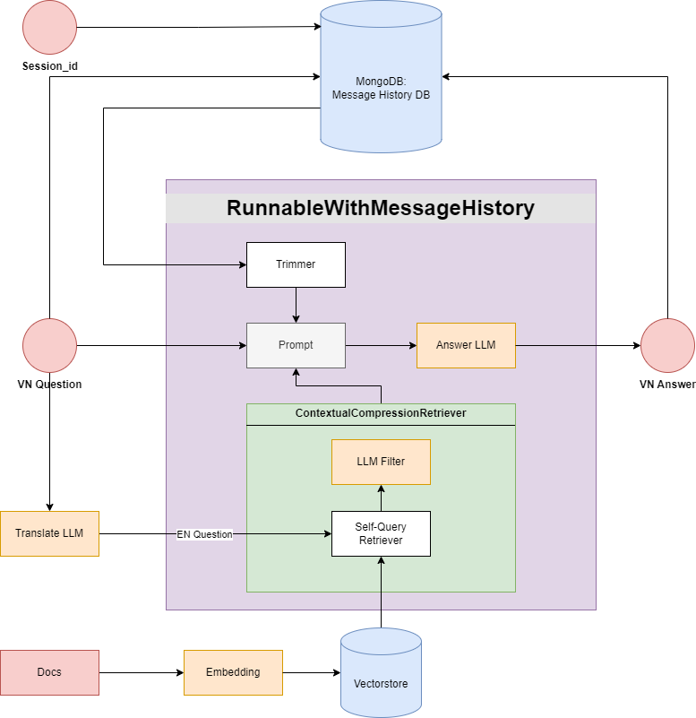

[][1]
[][2]
[][3]
[][4]

[1]: https://python.langchain.com/v0.2/docs/introduction/
[2]: https://openai.com/
[3]: https://docs.telethon.dev/en/stable/
[4]: https://www.mongodb.com/

# Enterprise Chatbot

Đây là chatbot được xây dựng để đóng vai trò là bách khoa toàn thư, là công cụ cung cấp thông tin để làm rõ các giá trị, sứ mệnh, và chính sách của doanh nghiệp và là ứng dụng để phục vụ cho quá trình đào tạo nội bộ của doanh nghiệp. Nó cần trình bày và giải thích chính xác nội dung đã được định nghĩa trước, như tuyên bố sứ mệnh hoặc hướng dẫn đạo đức của công ty.
Vì vậy mà bot cần phải có đặc điểm là phải có "Câu trả lời Chính xác cho Các Câu hỏi Cụ thể".
## Table of Contents
- [Introduction](#introduction)
- [Features](#features)
- [Installation](#installation)
- [Usage](#usage)
- [Configuration](#configuration)
- [Contributing](#contributing)
- [License](#license)

## Kiến trúc ChatBot



## Features

List the key features of your project:
- Feature 1: Brief description
- Feature 2: Brief description
- Feature 3: Brief description

## Installation

Step-by-step instructions to install the project. Include code snippets where necessary.

```sh
# Clone the repository
git clone https://github.com/username/project-name.git

# Navigate to the project directory
cd project-name

# Install dependencies
npm install

## References
https://python.langchain.com/v0.2/docs/how_to/message_history/
https://python.langchain.com/v0.2/docs/how_to/trim_messages/#chaining
