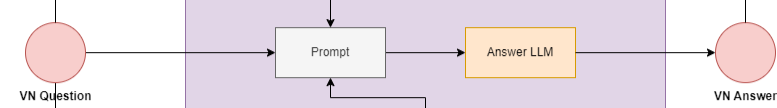
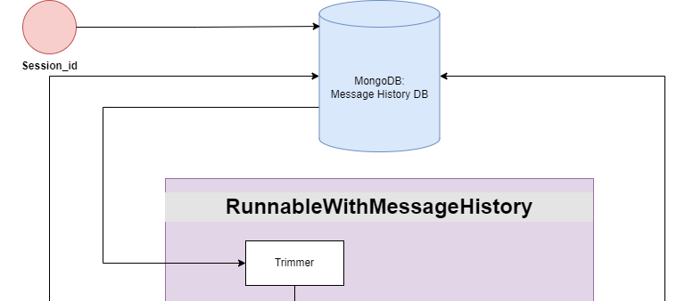
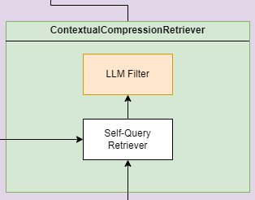
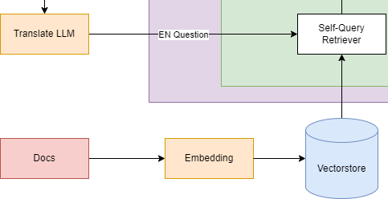
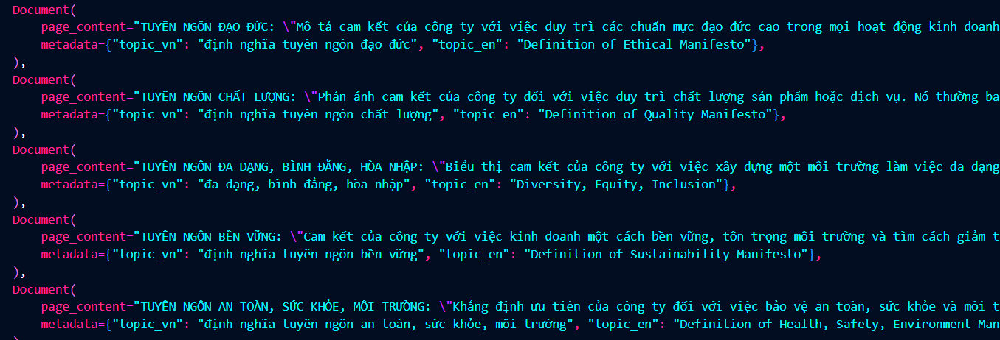
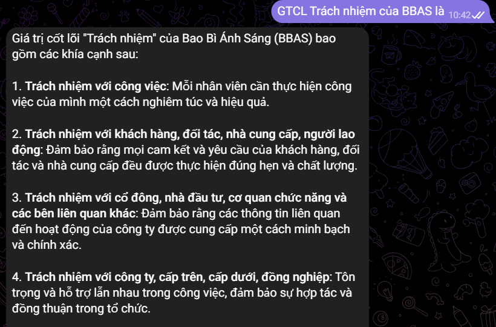
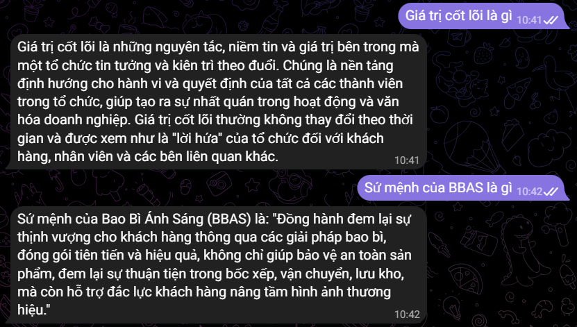
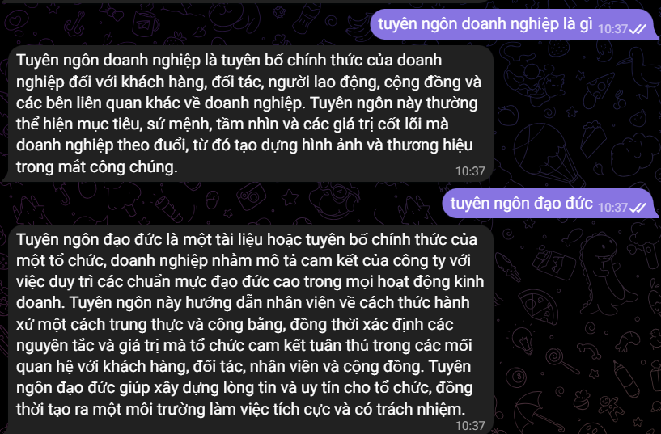

[][1]
[][2]
[][3]
[][4]

[1]: https://python.langchain.com/v0.2/docs/introduction/
[2]: https://openai.com/
[3]: https://docs.telethon.dev/en/stable/
[4]: https://www.mongodb.com/

# Enterprise Chatbot

Đây là chatbot được xây dựng để đóng vai trò là bách khoa toàn thư, là công cụ cung cấp thông tin để làm rõ các giá trị, sứ mệnh, và chính sách của doanh nghiệp và là ứng dụng để phục vụ cho quá trình đào tạo nội bộ của doanh nghiệp. Nó cần trình bày và giải thích chính xác nội dung đã được định nghĩa trước, như tuyên bố sứ mệnh hoặc hướng dẫn đạo đức của công ty.
Vì vậy mà bot cần phải có đặc điểm là phải có "Câu trả lời Chính xác cho Các Câu hỏi Cụ thể".
## Table of Contents
- [Kiến trúc hệ thống ChatBot](#kiến-trúc-hệ-thống-chatbot)
- [Các tiêu chí](#các-tiêu-chí)
- [Mô tả](#mô-tả)
- [Demo](#demo)
- [Installation](#installation)

## Kiến trúc hệ thống ChatBot


## Các tiêu chí

Danh sách các tiêu chí của hệ thống:
- Là hệ thống chat, chatbot phải sử dụng ngôn ngữ tự nhiên để trả lời các câu hỏi.
- Hệ thống chat phải có khả năng nhớ lịch sử các cuộc nói chuyện gần đây, hay ngữ cảnh của cuộc nói chuyện.
- Mô hình phải xử lý được các câu hỏi và trả về các câu trả lời là tiếng Việt chủ yếu.
- Độ chính xác câu trả lời cao: vì là chatbot xây dựng với mục đích đào tạo nội bộ, hay dùng để nêu lên các giá trị được doanh nghiệp cô đọng, nên chatbot phải có câu trả lời không được thiếu so với các định nghĩa hay các kiến thức trong các tài liệu.

## Mô tả

Để thỏa mãn được các tiêu chí trên, hệ thống đã được xây dựng các phần hệ thống theo mô tả dưới đây:

### Hệ thống sinh câu trả lời
Vì để có thể hiểu và trả lời các câu hỏi của người dùng chủ yếu là ở ngôn ngữ tự nhiên, ta sẽ sử dụng LLM để thu nhận câu hỏi và trả về câu trả lời.


### Hệ thống lưu lịch sử cuộc trò chuyện
Để lưu lại các cuộc hội thoại gần đây, hay nói cách khác là ngữ cảnh cuộc nói chuyện thì ta sẽ sử dụng MongoDB để làm cơ sở dữ liệu lưu trữ dữ liệu người dùng cũng như dữ liệu về các cuộc hội thoại. Khi người dùng đặt câu hỏi, hệ thống sẽ dựa vào session_id để tìm kiếm cuộc hội thoại và dùng [trimmer](https://python.langchain.com/v0.2/docs/how_to/trim_messages/#chaining) để quản lý độ dài của lịch sử cuộc nói chuyện. Sau đó thì đưa lịch sử cuộc nói chuyện đã được cắt gọn vào prompt.


### Hệ thống trích xuất tài liệu
Về hệ thống tìm kiếm tài liệu phù hợp với câu hỏi từ người dùng để hỗ trợ quá trình sinh câu trả lời cuối cùng, sử dụng [Contextual Compression Retriever](https://python.langchain.com/v0.2/docs/how_to/contextual_compression/) để lọc bớt các thông tin thừa, góp phần giảm token đầu vào cho mô hình, giảm bớt các thông tin nhiễu giảm độ chính xác câu trả lời, tăng thời gian, độ chính xác phản hồi. CCR bao gồm [Self-querying retriever](https://python.langchain.com/v0.2/docs/how_to/self_query/) và [LLM filter](https://python.langchain.com/v0.2/docs/how_to/contextual_compression/#llmchainfilter) để dùng LLM lọc bớt các thông tin không quan trọng. 
<div align="center">
  
</div>

Trước khi sử dụng Self-Querying Retriever, hệ thống đã từng sử dụng [Multi Vector Retriever: Small Chunks](https://python.langchain.com/v0.2/docs/how_to/multi_vector/#smaller-chunks). Tuy nhiên việc chủ yếu tài liệu là tiếng Việt và có nhiều định nghĩa, nhiều đoạn văn bản có sự tương đồng lớn (như "tầm nhìn của doanh nghiệp B là ..." và "đối với doanh nghiệp B thì định nghĩa tầm nhìn là ...") dẫn đến giảm sút đi độ chính xác của quá trình trích xuất thông tin. Dù đã sử dụng embedding dành riêng cho tiếng Việt như [vinai/phobert-base](https://huggingface.co/vinai/phobert-base), hay text-embedding-3-large của OpenAI thì vẫn không thể đáp ứng đủ độ chính xác về truy vấn. Vì vậy, Self-querying retriever đã được sử dụng để tìm kiếm dữ liệu dựa trên metadata và nó đã thực sự có tiến bộ hơn trước. Tuy nhiên, vẫn có trường hợp sai sót xảy ra, do căn bản việc similarity search vẫn dựa trên các vector sau khi đã được embedd từ các mô hình embedding trên.

### Hệ thống chuyển đổi ngôn ngữ
Để giải quyết vấn đề về ngôn ngữ ở trên, hệ thống chuyển đổi ngôn ngữ từ Việt sang Anh đã được áp dụng. Hệ thống sẽ dùng LLM để dịch ngôn ngữ từ Việt sang Anh và dùng câu hỏi tiếng Anh đó cho quá trình tìm kiếm. Lưu ý, câu hỏi tiếng Anh chỉ dùng cho quá trình tìm kiếm không sử dụng cho quá trình sinh câu trả lời.
<div align="center">
  
</div>

Còn tài liệu để tìm kiếm thì được chia ra thành các chunk nhỏ, mỗi chunk sẽ là mỗi định nghĩa, mỗi giá trị đã được doanh nghiệp trắc lọc. Đi theo các chunk đó là các metadata phục vụ cho quá trình tìm kiếm của retriever, các metadata bao gồm topic của câu hỏi được trong tiếng Việt và trong tiếng Anh.
<div align="center">
  
</div>


## Demo
Hệ thống sử dụng Telegram cho quá trình thử nghiệm khi xây dựng mô hình thông qua Telethon. Đây là câu trả lời trong 1 số câu hỏi:
<div align="center">
  
</div>
<div align="center">
  
</div>
<div align="center">
  
</div>

## Installation

Code này được chạy trên python3.10.10, thực hiện từng bước để cài đặt:

```sh
# Clone the repository
git clone https://github.com/PhucCorn/Company_statement_chatbot

# Install packages
pip install -r requirements.txt
